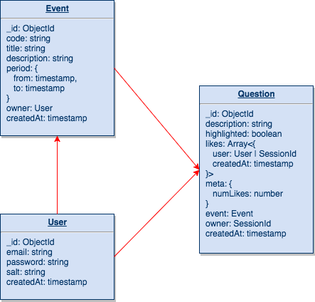
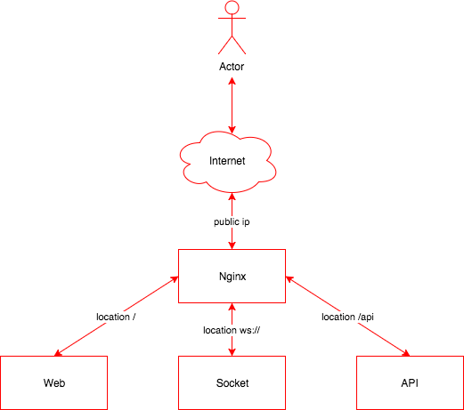

# shopback code challenge

## Requirements

View [Requirements file](./requirements.pdf).

## Design

### Database



### Architecture



## API Doc

View [Swagger YAML file](./api/swagger.yaml).

## Usage

### Prerequisites

Make sure docker & docker-compose is installed on your local machine.

### Install dependencies

Go to each app and install deps

```bash
cd web
yarn

cd ../api
yarn

cd ../socket
yarn

cd ..
```

### Development

```bash
cd devops
docker-compose up
```

The script will create 2 dirs `mongo` & `redis` for persistent data storage.

And the website is available at http://127.0.0.1
